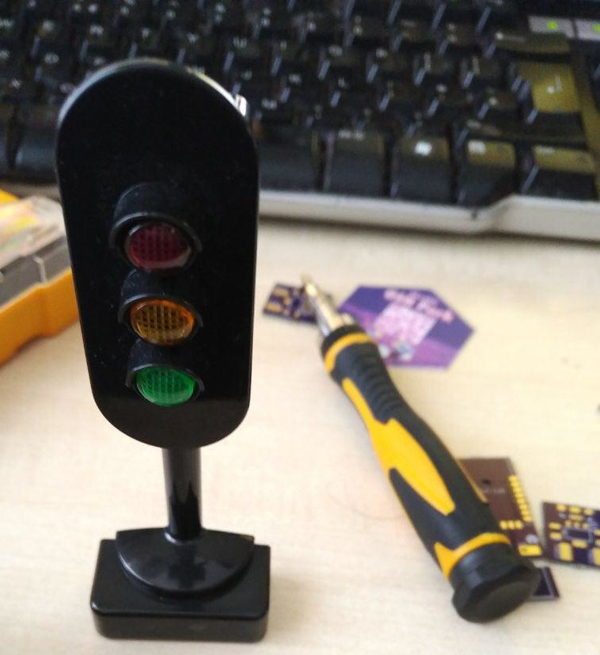
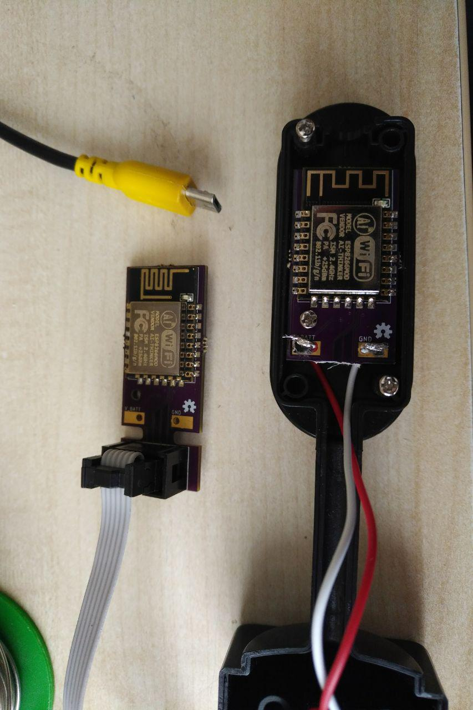
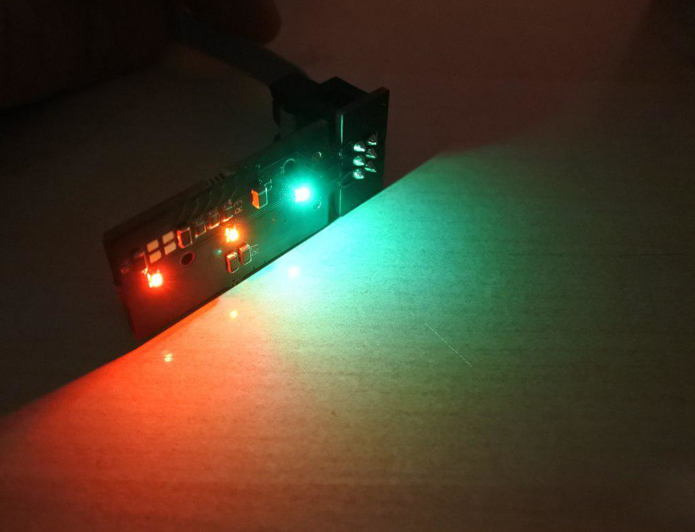
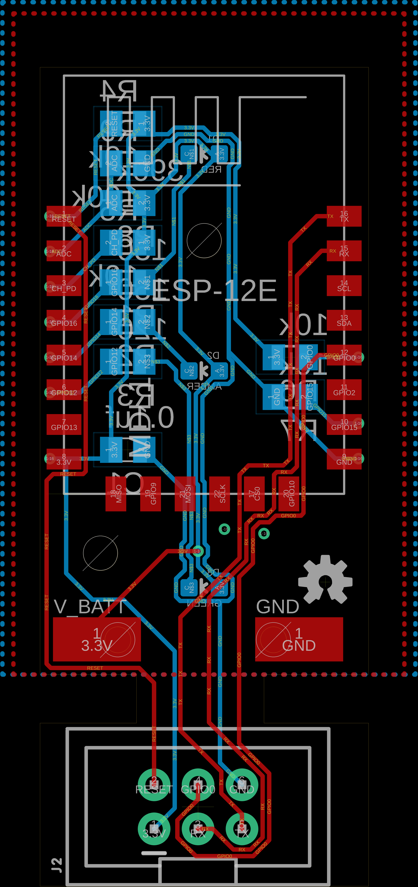
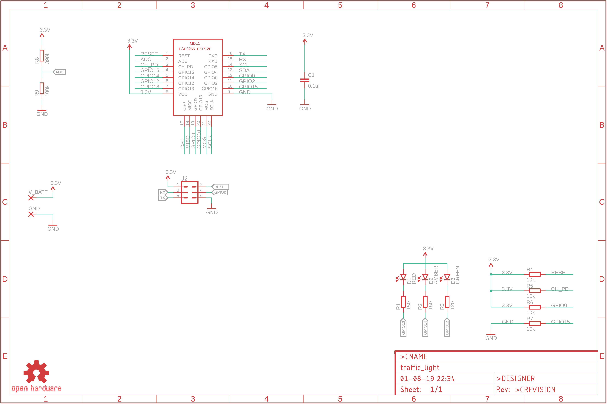

# Traffic Light

I saw a small, cheap traffic light toy in Spain. I figured it'd make a fun desk ornament. And then I realised it'd juuuust fit an ESP8266 module inside it.

I designed a small PCB with a breakoff programming harness to fit inside it, and to take a USB jack in the base for power.

You can [watch it do an over the air update](Assets/ota-update.mp4) or [change state based on mqtt events](Assets/listening-to-mqtt.mp4)

## So what is it?

## Board

## Schematic

## License
This project is licensed under the The TAPR Open Hardware License.

